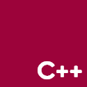

<h3>Hi! 👋 I'm Viet Anh, a Student studying Information Technology</h3>

	
	
	
	

<h4>🧬 Languages:</h4>

	
	
	
	

<h4>🥇 Top Starred Repos:</h4>

|#|Name|Star|Size|Language|Last Update||
|---|---|---:|---:|:---:|---|--|
|1|**[Assignment1](https://github.com/vietanh0562000/Assignment1)**|0 ⭐|0.0 MB|None|2021-01-29T10:40:23Z|0 ⚠  \|  0 🍴|
|2|**[AstroKnockServ](https://github.com/vietanh0562000/AstroKnockServ)**|0 ⭐|0.0 MB|None|2021-03-09T07:04:35Z|1 ⚠  \|  0 🍴|
|3|**[CourseManager](https://github.com/vietanh0562000/CourseManager)**|0 ⭐|0.04 MB|None|2019-11-11T04:12:10Z|0 ⚠  \|  0 🍴|

	⏰ <b>UPDATED:</b> 25/04/2021 06:45:13 AM (GMT+7)
	&emsp;&emsp;&emsp;&emsp;&emsp;&emsp;&emsp;&emsp;&emsp;&emsp;
	⚗ <b>GENERATED:</b>  1.4929s /w <a href="https://github.com/vietanh0562000/vietanh0562000/actions" target="_blank">Github Actions</a>
